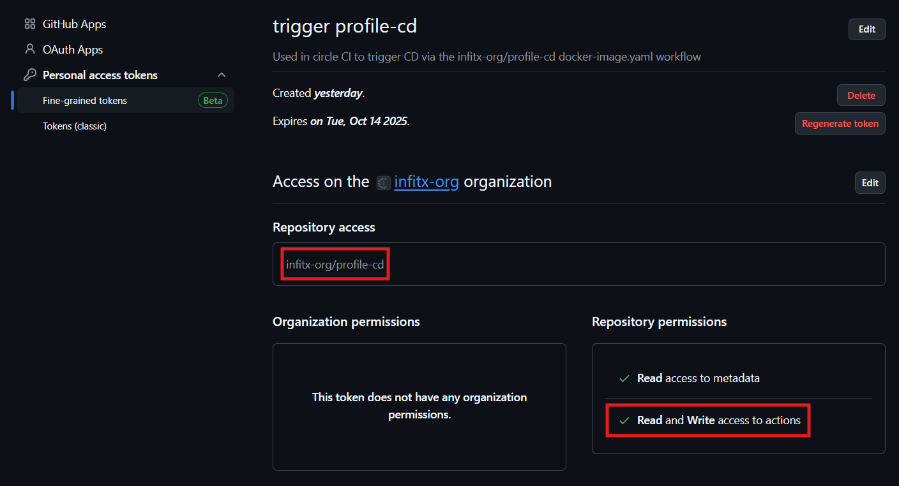
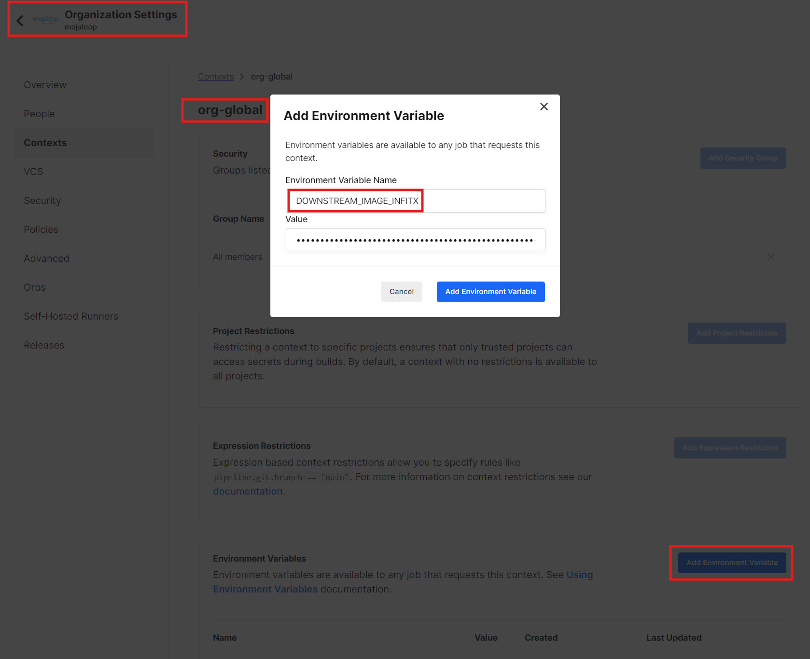
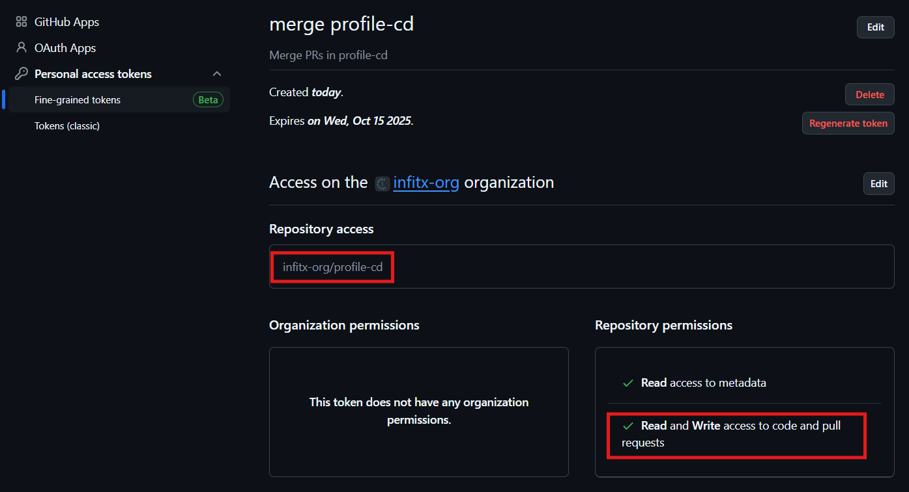
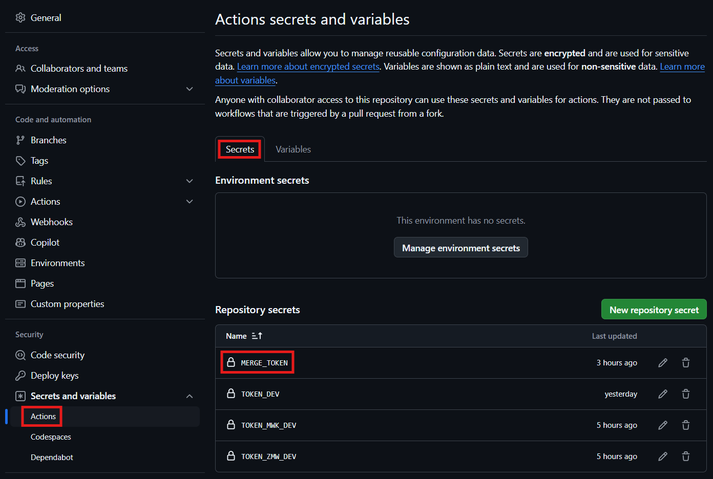
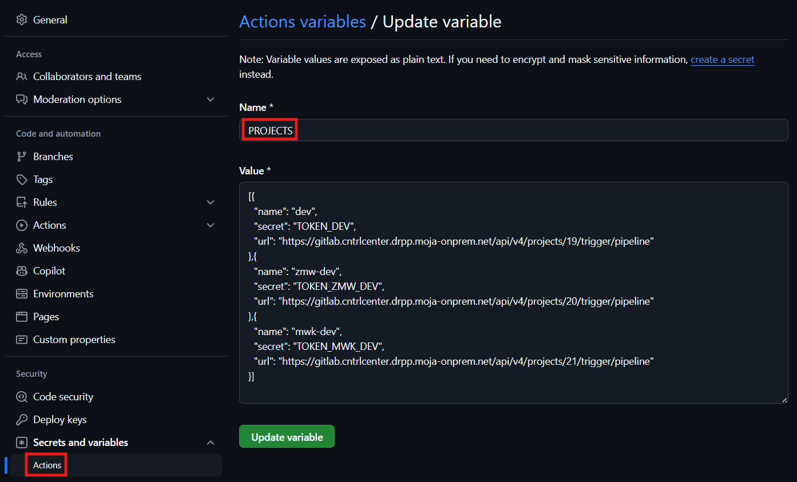
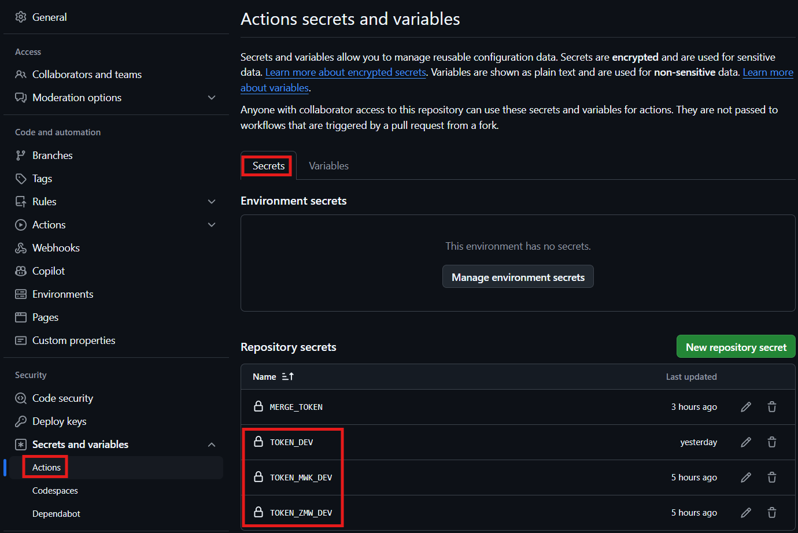
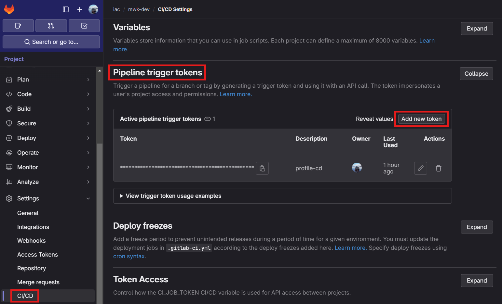

# Continuous deployment profile

This profile is configured to track Mojaloop docker image versions that
fulfill semver conditions so that the deployments in multiple environments
are always up to date.

## How to use

To use this profile, you need to add it to the environment, so that it
is applied last. To achieve this, you can prefix the profile folder name with
`z-` when adding it in the `submodules.yaml` file:

```yaml
profiles/z-continuous-deployment:
  url: https://github.com/infitx-org/profile-cd.git
  ref: main
```

## How it works

To achieve the automatic deployment of the Mojaloop docker images, there is
the following chain of events:

1. A commit in some of the Mojaloop repositiories triggers the Circle CI pipeline
   which builds and pushes the docker images to the Docker Hub when the tests pass.
1. Circle CI triggers the [docker-image.yaml](.github/workflows/docker-image.yaml)
   workflow in this repository.
1. This workflow checks the Docker Hub for the latest Mojaloop docker images that
   fulfill the semver conditions specified in the manifest files in the
   [updatecli.d](updatecli.d) directory.
1. If there are new images that fulfill the conditions, the workflow
   creates a pull request with the latest versions set in the `*-override.yaml`
   files, which is automatically merged.
1. The merge starts the [gitlab.yaml](.github/workflows/gitlab.yaml) workflow,
   which triggers a list of GitLab pipelines that apply the changes from this
   profile to the environments.

## Configuration

This chain of events relies on certain configurations:

1. A fine grained personal access token with `Write access to actions` for this
   repository:

   

   This token is set in an environment variable prefixed with `DOWNSTREAM_IMAGE_`
   in the Mojaloop Circle CI `org-global` context. The token if prefixed with
   the `organization/repository:` where it needs to trigger the workflow.
   For example `infinitx-org/profile-cd:github_pat_xxx`:

   

1. A fine grained personal access token with `Write access to code and pull requests`
   for this repository:

   

   This token is set in the `MERGE_TOKEN` repository secret in this repository:

   
1. An action variable named `PROJECTS` with the list of projects that are
   going to be updated by this profile:
   
1. A list of pipeline trigger tokens for each of the GitLab projects configured
   in the `secret` property for items in the above `PROJECTS` variable.
   These tokens are set in the corresponding action secrets:

   

   Tokens are created in each GitLab project's CI/CD settings:
   

## Specifying the conditions

The conditions for the images to be updated are specified in the manifest files
in the [updatecli.d](updatecli.d) directory. The files are named after the
images they are tracking. The conditions are specified in the
`sources.image.spec.versionfilter` property as a semver range:

```yaml
sources:
  image:
    spec:
      versionfilter: "..."
```

Commonly used conditions are:

1. `>=1.0.0-name.0 <=1.0.0-name.9999` for tracking a pre-release version with
   a specific `name`.
1. `^1.0.0` for tracking minor and patch versions without upgrading to a new
   major version or to pre-release versions.
